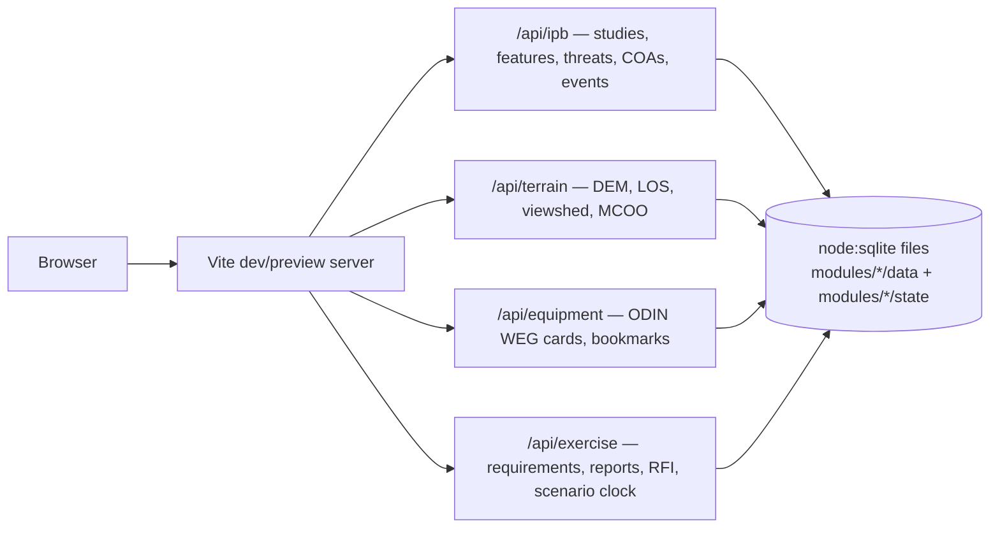

# IPB

A local, single-user Intelligence Preparation of the Battlefield workbench:
terrain effects (MCOO, line of sight, viewshed), threat evaluation against a
public equipment catalogue, threat courses of action with an event matrix, and
a classroom exercise layer (collection requirements, reports, RFIs, scenario
clock, AAR export).
Runs as one Node process against local SQLite databases — no Docker, no
external services, no accounts.



## Requirements

- Node **22.5+** (`node:sqlite`'s `DatabaseSync` needs it — check with `node -v`).
- Python **3.11+** for the equipment import tools. Standard library only, no
  `pip install` required.
- ~2.5 GB free disk for the equipment reference database (cards + images),
  ~500 MB for a terrain slice.

## Quickstart

```bash
npm install
npm run dev          # http://localhost:5180
```

The app starts, but `equipment` and `terrain` will report their data as
missing until you build it once (below) — nothing is checked into git.

## Building the reference data

Reference data lives in `modules/<id>/data/` and is rebuilt by a tool, never
hand-edited. It's gitignored on purpose: it's large, and it's reproducible.

### Equipment (ODIN Worldwide Equipment Guide)

```bash
python3 modules/equipment/tools/import_odin.py
```

Pulls the public, live WEG catalogue from `odin.t2com.army.mil` (distribution
unlimited; no CAC/DoD PKI access is used or needed) into
`modules/equipment/data/unitgenerator.db`, with images in `data/images/` and
API responses cached in `data/odin-cache/` so a rerun is cheap. Takes several
minutes on first run (~2 GB of images); safe to interrupt and rerun.

Useful flags: `--refresh` ignores the response cache, `--download-images
none|primary|all` controls how many images per card, `--workers N` controls
image-download concurrency (default 8).

For a small, fast, fully offline dataset instead (useful for UI work, not a
substitute for real coverage), use the bundled public sample:

```bash
python3 modules/equipment/tools/build_db.py
```

`modules/equipment/tools/unitdb.py` is a read-only CLI for poking at the
built database directly (`python3 unitdb.py search "T-72"`), handy when
debugging the importer or the API without going through the browser.

### Terrain (elevation + offline basemap)

```bash
node modules/terrain/tools/build_terrain.mjs --bounds <west,south,east,north>
```

Builds `modules/terrain/data/terrain.db`: a one-arc-second elevation grid
resampled from Copernicus GLO-30, used for slope, line-of-sight, viewshed, and
the MCOO mobility overlay. `--bounds` defaults to `17.2,49.5,17.8,49.9` (the
Libavá training area, Czech Republic) if omitted. The terrain API only has
data inside whatever bounds you build.

The 1°×1° GLO-30 tiles covering `--bounds` are downloaded from the public
[AWS Open Data bucket](https://registry.opendata.aws/copernicus-dem/) (no
account needed, ~40 MB per land tile) into `modules/terrain/data/glo30/` and
reused on later runs. Cells with no land have no tile and are skipped. To
build offline from GeoTIFFs you already have, pass `--source <dir>`; every
`.tif` in that directory is used and nothing is downloaded.

The mobility overlay also reads an offline vector basemap:
`modules/terrain/data/vector.pmtiles`, an OpenMapTiles-schema PMTiles archive
(needs the `water`, `waterway`, `building`, `landcover`, `landuse` layers).
Nothing in this repo downloads it. Build one with
[Planetiler](https://github.com/onthegomap/planetiler), whose default profile
is OpenMapTiles (needs Java 21+):

```bash
java -Xmx2g -jar planetiler.jar --download --area=czech-republic \
  --output=modules/terrain/data/vector.pmtiles
```

`--area` takes a [Geofabrik](https://download.geofabrik.de/) region name. The
first run also downloads ~1 GB of OpenMapTiles base sources (water polygons,
Natural Earth). Any existing `.pmtiles` archive with the same schema works
too.

## Modules

| Module      | Route                      | Data                                         | State                                                     |
| ----------- | -------------------------- | -------------------------------------------- | --------------------------------------------------------- |
| `equipment` | `/equipment/`              | ODIN WEG cards, images (read-only)           | bookmarks + notes                                         |
| `terrain`   | server-only, used by `ipb` | GLO-30 elevation, vector basemap (read-only) | —                                                         |
| `ipb`       | `/ipb/`                    | —                                            | studies: AOI, OAKOC features, threats, COAs, event matrix |
| `exercise`  | `/exercise/`               | —                                            | roster, PIR/SIR/indicators, reports, RFIs, scenario clock |

`exercise` can import an `ipb` study's event matrix (Requirements → Import
from IPB): each threat COA becomes a PIR, each NAI it uses a SIR, each
event-matrix row an indicator. Re-importing refreshes the wording and adds new
rows, but never deletes; rows no longer in the study are listed for you to
remove, and observations and evidence are kept.

Reference data (`modules/*/data/`) and working state (`modules/*/state/`) are
different files with different lifetimes: deleting a `state/*.db` resets that
module's work; deleting `data/*.db`/`.pmtiles` just means rerunning the
matching tool above.

## Scripts

| Command          | Does                                                                    |
| ---------------- | ----------------------------------------------------------------------- |
| `npm run dev`    | Vite dev server, `:5180`                                                |
| `npm run build`  | Production bundle to `dist/`                                            |
| `npm start`      | Preview the production build, `:8000`                                   |
| `npm test`       | Runs `src/geo.test.js` and any other `*.test.js` (Vitest via `vp test`) |
| `npm run check`  | Format check + lint + typecheck; run before committing                  |
| `npm run format` | Auto-format with Prettier conventions (`vp fmt --write`)                |
