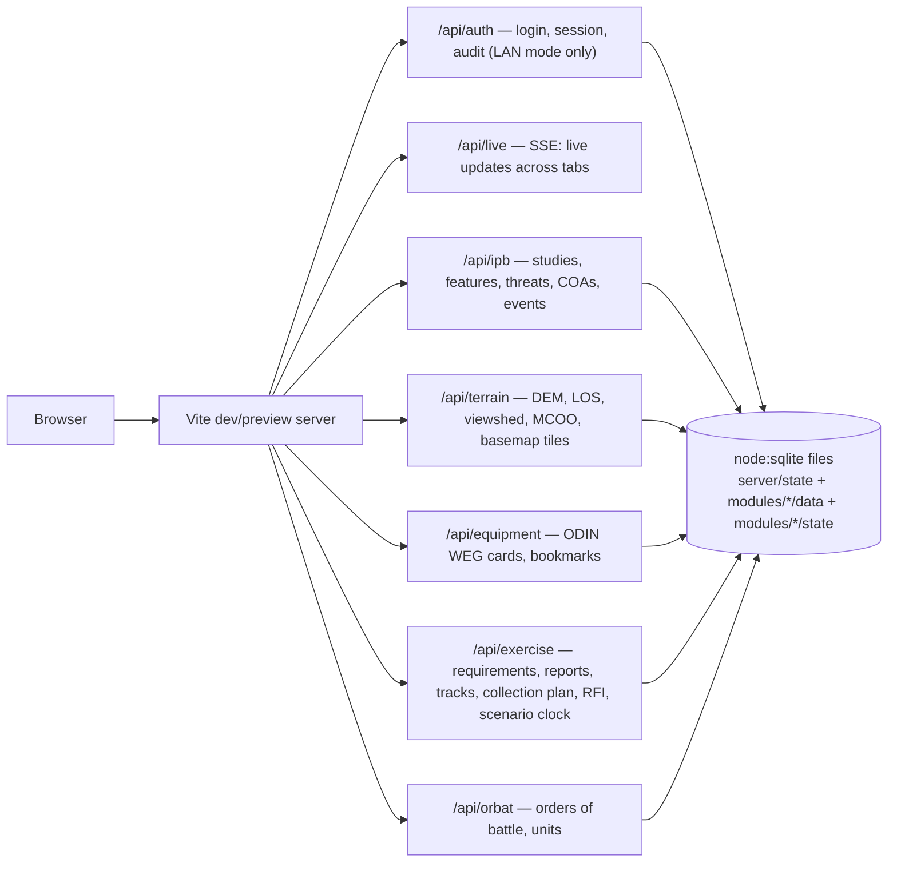

# IPB

A local Intelligence Preparation of the Battlefield workbench: terrain
effects (MCOO, line of sight, viewshed), threat evaluation against a public
equipment catalogue, threat courses of action with an event matrix, and a
classroom exercise layer (collection requirements, geolocated reports and a
current situation of tracks, a collection plan of collectors and taskings,
RFIs, scenario clock, INTSUM products, AAR export), and an ORBAT workbench
(NATO APP-6 symbology reference and order-of-battle builder). Single-user and
loopback-only by default, with no accounts; an opt-in LAN mode adds logins,
roles and an audit trail for a classroom of analysts sharing one exercise —
see [Users, roles and network access](#users-roles-and-network-access).
Runs as one Node process against local SQLite databases — no Docker, no
external services. (Opt-in exceptions, each needing internet only while
switched on: the "OpenTopoMap", "Satellite HD" and "ČÚZK Ortho" basemaps, see
[Basemaps](#basemaps), and the real-time [weather](#weather-online) layers
and forecast.)

Current priorities and observed rehearsal results: [Current backlog and acceptance
evidence](docs/current-backlog.md). Deployment procedures: [Operator runbook](docs/operator-runbook.md).



## Requirements

- Node **22.5+** (`node:sqlite`'s `DatabaseSync` needs it — check with `node -v`).
- Python **3.11+** for the equipment import tools. Standard library only, no
  `pip install` required.
- ~2.5 GB free disk for the equipment reference database (cards + images),
  ~500 MB for a terrain slice.

## Quickstart

```bash
npm install
npm run dev          # http://localhost:5180
```

The app starts, but `equipment` and `terrain` will report their data as
missing until you build it once (below) — nothing is checked into git.

## Building the reference data

Reference data lives in `modules/<id>/data/` and is rebuilt by a tool, never
hand-edited. It's gitignored on purpose: it's large, and it's reproducible.

### Equipment (ODIN Worldwide Equipment Guide)

```bash
python3 modules/equipment/tools/import_odin.py
```

Pulls the public, live WEG catalogue from `odin.t2com.army.mil` (distribution
unlimited; no CAC/DoD PKI access is used or needed) into
`modules/equipment/data/unitgenerator.db`, with images in `data/images/` and
API responses cached in `data/odin-cache/` so a rerun is cheap. Takes several
minutes on first run (~2 GB of images); safe to interrupt and rerun.

Useful flags: `--refresh` ignores the response cache, `--download-images
none|primary|all` controls how many images per card, `--workers N` controls
image-download concurrency (default 8).

For a small, fast, fully offline dataset instead (useful for UI work, not a
substitute for real coverage), use the bundled public sample:

```bash
python3 modules/equipment/tools/build_db.py
```

`modules/equipment/tools/unitdb.py` is a read-only CLI for poking at the
built database directly (`python3 unitdb.py search "T-72"`), handy when
debugging the importer or the API without going through the browser.

`GET /api/equipment/cards/:identifier/ranges` (404 for an unknown card) and
`POST /api/equipment/ranges {identifiers: [...]}` (≤ 200, a map keyed by
identifier) parse a WEG card's weapon ranges out of its free-text properties
— `modules/equipment/server/ranges.js`, `parseRanges` pure and unit-tested —
for range rings on the map: `{ system, kind: 'effective'|'maximum'|
'minimum'|'sight'|'other', min_m, max_m, raw }` per weapon system, in
metres, with everything that is not a weapon's own reach (frequency,
traverse/elevation, cruising/ferry/operational, radio, sensor detection)
excluded by name and by section (`Automotive`, `Communications`,
`Propulsion`, `Radar`, `Performance`).

### Terrain (elevation + offline basemap)

```bash
node modules/terrain/tools/build_terrain.mjs --bounds <west,south,east,north>
```

Builds `modules/terrain/data/terrain.db`: a one-arc-second elevation grid
resampled from Copernicus GLO-30, used for slope, line-of-sight, viewshed, and
the MCOO mobility overlay. `--bounds` defaults to `17.2,49.5,17.8,49.9` (the
Libavá training area, Czech Republic) if omitted. The terrain API only has
data inside whatever bounds you build: contours, slope classes, hillshade,
viewshed, line of sight and the MCOO all stop at its edge. Covering a whole
country is practical — all of Czechia (`--bounds 12.09,48.55,18.87,51.06`, the
extent of a Czech Geofabrik extract) is 28 GLO-30 tiles, ~1 GB downloaded,
an 890 MB `terrain.db`, and about a minute to build.

The 1°×1° GLO-30 tiles covering `--bounds` are downloaded from the public
[AWS Open Data bucket](https://registry.opendata.aws/copernicus-dem/) (no
account needed, ~40 MB per land tile) into `modules/terrain/data/glo30/` and
reused on later runs. Cells with no land have no tile and are skipped. To
build offline from GeoTIFFs you already have, pass `--source <dir>`; every
`.tif` in that directory is used and nothing is downloaded.

#### Elevation detail: ČÚZK DMR 4G (5 m, Czechia only)

```bash
node modules/terrain/tools/build_dmr4g.mjs
```

Builds `modules/terrain/data/terrain-dmr4g.db`, a 5 m bare-earth grid from
ČÚZK's DMR 4G (LiDAR, Bpv heights), served as a detail layer over `terrain.db`
wherever both exist — the server picks the finer value automatically, so
elevation, slope, hillshade, contours, profile, line of sight and viewshed all
sharpen with no change on the client and no restart (`server/dem.js`'s
`openElevation`). Missing `terrain-dmr4g.db` falls back to GLO-30 alone,
exactly as before this layer existed. Hillshade, slope and contour tiles are
served up to zoom 16 instead of 14 once detail is built.

Without `--bounds`, every one of the ~20,300 2×2 km sheets ČÚZK's
[ATOM feed](https://atom.cuzk.gov.cz/DMR4G-ETRS89-TIFF/DMR4G-ETRS89-TIFF.xml)
lists is downloaded (resumable, `--concurrency`, default 8, into
`modules/terrain/data/dmr4g/`) and reprojected from ETRS89/TM33N onto the same
grid scheme as `terrain.db`, using a `worker_threads` pool (`--workers`,
default up to 32) and a hand-written, unit-tested UTM33N transform (no extra
dependency — `modules/terrain/tools/utm33.mjs`). All of Czechia is the whole
feed: ~11 GB downloaded, an 18 GB `terrain-dmr4g.db`, about 14 minutes on a
32-core machine. `--bounds west,south,east,north` builds a smaller area only.

**Licence:** ČÚZK publishes DMR 4G with "no conditions apply"; attributed here
as ČÚZK open data (CC BY 4.0), "© ČÚZK".

#### Server-side worker pool

Viewshed, key-terrain, mobility (MCOO), avenues-of-approach and the
hillshade/slope/contour tile renders run on a small `node:worker_threads`
pool (`modules/terrain/server/pool.js`), not the main thread — a 15 km
viewshed used to freeze every other request (including unrelated modules)
for as long as it ran. Cheap lookups (`elevation`, `meta`) stay on the main
thread. Pool size is `IPB_TERRAIN_WORKERS`, default
`clamp(cores - 2, 1, 4)`: each worker opens its own copy of the elevation
model with its own DEM tile cache, and the DMR 4G detail cache alone is
~384 MB per worker (1536 tiles × 256×256 float32), so on the target
8-core/16 GB box that's 4 workers and ~1.5 GB of DEM cache — raise it only
after shrinking `DETAIL_TILE_CACHE_LIMIT` (`modules/terrain/server/paths.js`)
to fit.

Jobs run in two lanes. **Analyses** (viewshed, key terrain, MCOO, avenues,
extremes) take seconds: more than one running plus one queued for the same
signed-in user (or IP, signed out) answers `429`, and they never occupy
every worker, so one is always free for tiles. **Tiles** (hillshade, slope,
contours) take milliseconds but a map view asks for dozens at once: no
per-user limit, their own longer queue, served before any queued analysis,
and never cancelled (the render fills the shared tile cache). A full queue
answers `503`. A disconnected client's queued analysis is dropped and its
running one's worker is terminated and replaced (simpler and always correct
next to threading a cooperative abort flag through every hot loop).

**Bare-earth caveat:** DMR 4G is a _terrain_ model — it has no trees or
buildings, unlike GLO-30 (a _surface_ model that includes both). Line of sight
and viewshed results over forested or built-up ground get more optimistic
(more "visible") once this detail layer is built, because the canopy and
rooftops GLO-30 saw are gone from the DMR 4G area. ČÚZK does also publish a
surface model — DMP 1G — but only as LAZ point clouds
([atom.cuzk.gov.cz/DMP1G-ETRS89](https://atom.cuzk.gov.cz/DMP1G-ETRS89/DMP1G-ETRS89.xml),
20,308 sheets, no TIFF ATOM feed exists for it) and DMP OK, a photogrammetric
surface model that _is_ published as TIFF over ATOM
([atom.cuzk.gov.cz/DMPOK-SJTSK-TIFF](https://atom.cuzk.gov.cz/DMPOK-SJTSK-TIFF/DMPOK-SJTSK-TIFF.xml),
16,301 SM5 sheets, S-JTSK only, ~60 MB per sheet — roughly a terabyte for all
of Czechia). Neither is built by this tool; building one would need its own
LAZ rasterizer (DMP 1G) or an S-JTSK↔WGS84 transform plus a much larger
download budget (DMP OK).

The mobility overlay also reads an offline vector basemap:
`modules/terrain/data/vector.pmtiles`, an OpenMapTiles-schema PMTiles archive
(needs the `water`, `waterway`, `building`, `landcover`, `landuse` layers).
Nothing in this repo downloads it. Build one with
[Planetiler](https://github.com/onthegomap/planetiler), whose default profile
is OpenMapTiles (needs Java 21+):

```bash
java -Xmx2g -jar planetiler.jar --download --area=czech-republic \
  --output=modules/terrain/data/vector.pmtiles
```

`--area` takes a [Geofabrik](https://download.geofabrik.de/) region name. The
first run also downloads ~1 GB of OpenMapTiles base sources (water polygons,
Natural Earth). Any existing `.pmtiles` archive with the same schema works
too.

No Java installed? A portable runtime works without root; keeping it under
the gitignored `data/` directory keeps everything rebuildable in one place:

```bash
mkdir -p modules/terrain/data/planetiler/jre && cd modules/terrain/data/planetiler
curl -L -o planetiler.jar https://github.com/onthegomap/planetiler/releases/latest/download/planetiler.jar
curl -L https://api.adoptium.net/v3/binary/latest/21/ga/linux/x64/jre/hotspot/normal/eclipse \
  | tar -xz -C jre --strip-components=1
./jre/bin/java -Xmx8g -jar planetiler.jar --download --area=czech-republic \
  --output=../vector.pmtiles --force
```

For Czechia this downloads ~2 GB (runtime, Planetiler, the 903 MB OSM extract,
base sources; ~2.5 GB on disk, reused on rebuilds), takes about 3 minutes, and
writes a ~620 MB archive. Restart the dev server afterwards; the browser
revalidates the archive, so it never mixes old and new bytes.

The "Place names" overlay additionally needs the `place`, `mountain_peak` and
`water_name` layers. The command above (Planetiler's default profile) includes
them; an archive built with `--only-layers` or trimmed to the five layers above
does not, and the overlay is then greyed out.

### Satellite imagery (optional)

```bash
node modules/terrain/tools/build_satellite.mjs
```

Downloads [EOxCloudless](https://cloudless.eox.at) Sentinel-2 imagery (10 m,
zoom 8–14) into `modules/terrain/data/satellite.mbtiles` for the offline
"Satellite" basemap. `--bounds` defaults to the built `terrain.db`'s bounds; the
Libavá default is ~1,200 tiles, ~11 MB, well under a minute. The tool stops
above 20,000 tiles so a wide `terrain.db` doesn't start a huge download by
accident: pass `--bounds` for your area of interest, lower `--max-zoom`, or
raise the cap with `--max-tiles`. All of Czechia at zoom 8–14 is ~73,500 tiles
(`--max-tiles 80000`, ~1 GB, ~20 minutes). `--year` picks the mosaic (default
2025). Safe to interrupt; rerunning with the same year and bounds resumes, and
keeps the tiles of a lower `--max-zoom` run.

The running server picks up a rebuilt `satellite.mbtiles`, `ortho.mbtiles`,
`terrain.db` or `unitgenerator.db` on the next request; no restart needed.

**Licence:** 2016 imagery is CC BY 4.0; 2017 and later are **CC BY-NC-SA 4.0,
non-commercial only** — commercial use needs a licence from EOX. The map shows
the required attribution.

### Aerial imagery (ČÚZK ortho, optional)

```bash
node modules/terrain/tools/build_satellite.mjs --source cuzk --study 3
```

Downloads [ČÚZK Ortofoto](https://ags.cuzk.gov.cz/arcgis1/rest/services/ORTOFOTO_WM/MapServer)
(sub-metre aerial photography, native to zoom 20) into
`modules/terrain/data/ortho.mbtiles` for the offline "Aerial" basemap, and
backs the online "ČÚZK Ortho" basemap directly (no build needed for that one).
Same tool as satellite imagery, with `--source cuzk`: `--bounds` defaults to
`terrain.db`'s bounds and zoom defaults to 12–18; `--study <id>` fetches the
saved AOI of an IPB study instead — the easy way to grab a chosen area of
interest — reading it read-only from the analyst's own study database.
`--bounds` and `--study` are exclusive. Concurrency 4 and the same
back-off/resume/`--max-tiles` behaviour as the EOX source.

**Size guidance:** ČÚZK tiles average ~30 KB (measured over Libavá at zoom
12–18). A district-sized AOI like Libavá (`17.2,49.5,17.8,49.9`) at zoom
12–18 is ~265,000 tiles, ~7.4 GB (`--max-tiles 300000`); keep AOIs to a
training area or two studies. All of Czechia at zoom 12–18 is ~18.6 million
tiles, ~520 GB — don't; use `--study` or `--bounds` to fetch only the ground
you need.

**Licence:** CC BY 4.0, © ČÚZK. The map shows the required attribution.

### Scenario regions (for Exercise geography)

```bash
node modules/exercise/tools/build_regions.mjs
```

Builds `modules/exercise/data/regions.json`: the 14 Czech kraje and 77 okresy
(Praha counts as an okres too), for composing exercise countries in the
Exercise module. Downloads the [ČÚZK](https://cuzk.gov.cz) RÚIAN whole-state
shapefile (~253 MB, CC BY 4.0, © ČÚZK) into `modules/exercise/data/cache/`
and reuses it on later runs; reprojects to WGS84 and simplifies with topology
preserved (mapshaper) so neighbouring regions and unions have no slivers or
gaps. Takes a few seconds after the first download.

## Workspace

The IPB map fills the window. The step tools (left) and the worksheet (right)
float over it as sheets; put either away and bring it back with the two panel
buttons in the status bar, or `[` / `]`. Which sheets are out is remembered in
the browser. On a narrow screen (≤ 980 px) the sheets dock to the bottom half,
one at a time, and the status bar rides above them. Zooming to the AOI or a
feature keeps it clear of the open sheets. Printing always includes the
worksheet, whether its sheet is out or not.

The map carries only two controls of its own:

- **Map ▾** (top right): the basemap, the overlays (MGRS grid first, then
  contours, slope, roads, place names, weather and the current situation) and
  a note when a scenario is active. See [Basemaps](#basemaps).
- **The status bar** along the bottom: the pointer's MGRS reference and the
  ground elevation under it, a scale bar, the **Measure**, **Graphics** and
  **Rings** tools (icons only when both sheets leave it narrow; hover for the
  name), the sheet buttons, zoom, and **ⓘ** for attribution and the elevation
  dataset.

The masthead holds the open study (click it, or press `/`, to switch; ordinary
cell members open their cell's exercise study automatically) and the active
scenario. In worksheet lists, click an item's name to go to it; its other
actions (rename, move, delete…) are in its **⋯** menu.

Other keys, when not typing in a field: `1`–`4` switch steps, Escape cancels
the active map tool and closes an open menu.

The interface is a dark console for dim rooms; printouts are dark on white.
Its typefaces (IBM Plex Sans, Sans Condensed and Mono) ship with the app, so
it looks the same offline and on every OS.

## Basemaps

**Map ▾** picks the basemap; the ones marked online need internet only while selected:

| Basemap         | Source                                                                                                                         | Offline |
| --------------- | ------------------------------------------------------------------------------------------------------------------------------ | ------- |
| Roads (default) | `vector.pmtiles`                                                                                                               | yes     |
| Terrain         | Roads plus hillshade rendered from `terrain.db`                                                                                | yes     |
| Topo            | Topographic style of `vector.pmtiles` + hillshade, contour lines and place names                                               | yes     |
| Satellite       | `satellite.mbtiles` inside its bounds, Roads around it                                                                         | yes     |
| Aerial          | `ortho.mbtiles` (ČÚZK) inside its bounds, Roads around it                                                                      | yes     |
| OpenTopoMap     | [OpenTopoMap](https://opentopomap.org): names, peaks, paths, contours (CC BY-SA)                                               | **no**  |
| Satellite HD    | [Esri World Imagery](https://www.arcgis.com/home/item.html?id=10df2279f9684e4a9f6a7f08febac2a9), sub-metre                     | **no**  |
| ČÚZK Ortho      | [ČÚZK Ortofoto](https://ags.cuzk.gov.cz/arcgis1/rest/services/ORTOFOTO_WM/MapServer), sub-metre, Czechia only, Roads around it | **no**  |

**Topo** is built for reading training areas: land cover (forest, meadow,
scrub, wetland) is drawn everywhere, tracks are dashed and paths dotted, and
military land (`landuse=military`) is only a dashed purple boundary. OSM wraps
a whole training area in one military polygon; OpenTopoMap hatches it red and
the Roads style fills it flat, both hiding the ground inside. Topo draws its
contours and names itself, so those two overlays show as included while it is
selected.

The chosen basemap, overlays and MGRS grid toggle are remembered in the
browser. **Print worksheet** (or Ctrl+P) puts the current map view on page 1
with a scale bar, a caption (study, step, centre MGRS, basemap, overlays) and
the attributions, followed by the worksheet. Step 1's **Light data** table
lists BMNT/BMCT, sunrise/sunset, EECT/EENT, moonrise/moonset and moon
illumination for the AOI centre, computed offline (`src/astro.js`, within a
minute of the US Naval Observatory's tables).

Step 2 adds three analysis aids on top of the MCOO, line of sight and
viewshed, all offline:

- **Combined viewshed**: add up to 10 observation posts (tool panel or
  right-click); the overlay shows dead ground, ground seen by one post and
  ground seen by two or more.
- **Key terrain candidates**: summits in the AOI above a chosen prominence,
  ranked by the ground each overlooks within 3 km and named from the basemap's
  peaks; accept one to add it as a key-terrain point.
- **Avenues of approach**: pick a start and an objective and a corridor width;
  up to three routes through the MCOO that keep the whole corridor off NO-GO
  ground, preferring GO over SLOW-GO; save one as an avenue.

In the MCOO, rivers, canals, lakes and wetlands are NO-GO; mapped streams are
SLOW-GO (mostly fordable, but restricting).

A basemap whose data has not been built is greyed out, with the command to
build it in its tooltip. OpenTopoMap, Satellite HD and ČÚZK Ortho talk to an
outside service only while selected (the only other online parts are the
[weather](#weather-online) layers). All three require the on-map attribution;
none allows bulk-caching its tiles for offline use.

Below the switch, **Layers** adds overlays that work over any basemap, all
offline:

| Overlay       | Source                                                                                 |
| ------------- | -------------------------------------------------------------------------------------- |
| Contour lines | Traced from `terrain.db`: 10 m lines, 50 m labelled index lines, coarser zoomed out    |
| Slope classes | `terrain.db` slope in the MCOO bands: SLOW-GO 10–30° (amber), NO-GO ≥ 30° (red)        |
| Roads & water | Roads, rivers and lakes from `vector.pmtiles`, drawn to read over the satellite layers |
| Place names   | Towns, villages, peaks and waters from `vector.pmtiles` (needs its name layers, above) |

### Weather (online)

The **Weather** group in Layers streams current conditions, each labelled
with the time of its data and refreshed while switched on:

| Layer               | Source                                                                                                                          | Updated      |
| ------------------- | ------------------------------------------------------------------------------------------------------------------------------- | ------------ |
| Clouds              | [EUMETSAT](https://view.eumetsat.int) Meteosat cloud mask (~4–6 km pixels here), cloud shaded, clear ground left as is          | every 15 min |
| Precipitation radar | [RainViewer](https://www.rainviewer.com/api.html) radar mosaic, past 2 h in 10-min frames; Play or drag the slider to step back | every 10 min |
| Lightning           | EUMETSAT Meteosat Third Generation Lightning Imager, accumulated flash area (yellow → red: more flashes)                        | every 5 min  |
| Wind (10 m)         | [Open-Meteo](https://open-meteo.com) model wind on a lattice over the view: arrows point downwind, labels m/s (gusts)           | every 15 min |

Each study has a **weather point**: by default the AOI centre (area-weighted;
for a strongly curved AOI set the point yourself), or a point you set in
step 1's tool panel
(MGRS/UTM/decimal degrees, or **Pick on map**) or by right-clicking the map →
**Set weather point here**; **Use AOI centre** goes back to automatic. In
step 1 the map marks it, plus the AOI's highest and lowest ground, found
offline from `terrain.db` inside the AOI polygon.

Step 1's **Weather** block (button **Get weather**) then shows:

- a 48-hour Open-Meteo forecast at the weather point: current conditions,
  then one row per 3 h with weather, temperature, wind and gusts,
  precipitation total and chance, total and low cloud, and visibility.
  Temperatures are corrected to the real ground height from `terrain.db`
  (the model's own grid cell can sit tens of metres higher or lower);
- **Across the AOI**: temperature, wind, low cloud and visibility at the
  weather point / highest / lowest ground side by side (ridge exposure,
  hill fog, valley fog and frost);
- **Measured nearest the weather point**: the latest 10-minute values of
  the Czech Hydrometeorological Institute's stations (opendata.chmi.cz, CC
  BY 4.0, ~300 stations), each quantity — temperature and humidity, wind
  and gusts, precipitation over the last hour, station pressure — from the
  nearest station that measured it in the last 2 h, with its distance,
  direction and time. Many stations are rain gauges only, so the stations
  can differ per row; around Libavá they are 9–11 km away. Only stations
  within 60 km count, so outside Czechia this row is absent. Through this
  server (`GET /api/ipb/weather/measured?at=lon,lat`), which loads the
  station list once a day and a station's file at most every 5 min;
- **Nearest airfield report**: the latest measured report (METAR) of the
  closest reporting airfield (cloud, ceiling and visibility, which the
  ČHMÚ 10-minute data does not include), with distance and bearing, decoded to metric
  (wind m/s, visibility km, cloud and ceiling in metres above the station)
  plus the raw report. It comes from aviationweather.gov (NOAA) through this
  server (`GET /api/ipb/weather/station?at=lon,lat`), because that service
  does not answer browsers directly. Around Libavá the closest is Ostrava,
  ~45 km away; military airfields do not publish.

It all prints with the worksheet; the printed map caption lists each weather
layer with its data time.

Nothing weather-related is cached for offline use, and none of it starts on
its own: every request tells the service which area is being looked at
(the weather point and the AOI's highest and lowest ground), so use these
only where that is acceptable. Terms: RainViewer's free API is for personal
and educational use; Open-Meteo's free API is non-commercial (data CC BY
4.0); ČHMÚ open data is CC BY 4.0; EUMETSAT imagery is credited on the map;
NOAA data is public domain.

### Custom layers

Below the step tools, in every step, **Custom layers** holds your own named
layers of points (observation posts, contacts, landmarks…), saved with the
study. Each layer has a colour and a show/hide box; each point a name, a
position and a note. Add points:

- by position: select the layer, type a name, an MGRS/UTM/decimal-degree
  position and an optional note, **Add**;
- by clicking: **Add on map**, then every click on the map asks for a name
  and note (the position is filled in; Enter in the note is a new line,
  Enter in the name saves) until Escape;
- by right-clicking the map → **Add point here** → a layer, or **New layer…**.

Right-click a point to **Edit…** (name, position, note), **Move (drag)**,
copy its coordinates or delete it; the layer's list has the same plus **Go
to**. Deleting a layer deletes its points. Printed worksheets end with a
table per layer (name, MGRS, note).

### Map tools

Every map built on `src/map.js` (IPB, and the Exercise Situation map) shares
three offline capabilities, all drawn as ordinary vector layers so print and
**Export image** pick them up automatically:

- **Tactical graphics** (`src/tactical.js`): phase lines, boundaries, an axis
  of advance (a true geodesic arrow corridor, `properties.width_m`, default
  1000 m), a direction of attack, OBJ/AA/BP/EA areas, a minefield, an
  obstacle line, and the block/fix/turn/disrupt obstacle effects — ADP 1-02 /
  APP-6 control-measure conventions drawn as closely as OpenLayers vector
  styles allow. Coloured by affiliation (friendly/hostile/neutral/unknown, or
  plain ink with none set), with a casing that keeps every line and label
  legible on both the pale vector basemap and dark imagery.
- **Measure** (`src/measure.js`): distance (per-segment and total, metres
  below 1 km else kilometres), area (hectares below 100 ha else km²), and
  bearing (click one point then another: true degrees and NATO mils, 6400
  per circle) — all geodesic (`ol/sphere`), drawn as on-map labels, never
  saved. Escape or a right-click on the map finishes/stops it; starting a
  draw or an edit stops it too, and vice versa.
- **Range rings**: a point feature (`layer` `range-ring`) with
  `properties.radii` (metres, ascending, 1–8, each ≤ 100 km) draws one dashed
  geodesic circle per radius, labelled at its north point, coloured by
  `properties.affiliation`.

The **current situation** — Exercise's tracks (confirmed/suspected/
destroyed/lost, with a position history) and reports — overlays any of these
maps: a track shows its SIDC icon with a designation and DTG label (dashed
"planned" frame while suspected, faded once destroyed or lost) and a thin
dashed history trail; a report is a small marker filled solid, half or
hollow by credibility, labelled with its type above zoom 12. Clicking a
track or report takes priority over the map's normal feature click.

### IPB data model additions

Beyond the terrain/threat basics, a study also holds:

- **`ao`** and **`aoi`**: the area of operations and area of interest, each a
  GeoJSON `Polygon` (WGS84, closed rings, at least 3 different corners, at
  most 5,000) or `null`, set by `PATCH studies/:id` and checked against
  `src/areaPolygon.js`. The weather point and light data default to the AOI
  centre, else the AO centre.
- **Units, tactical graphics and range rings** as `features` (`layer` `unit` /
  `graphic` / `range-ring`): a unit is a `symbol`-kind point with a
  `properties.sidc`; a graphic is a line or polygon with a
  `properties.graphic` key (`TACTICAL_GRAPHICS`) matching its geometry; a
  range ring is a point with `properties.radii` (metres, ascending, 1–8, each
  ≤ 100 km). Any feature's `properties.coa_id` ties it to a COA; a SITEMP
  unit or sketch with no `coa_id` shows on every COA.
- A unit's `properties` may also hold its APP-6 **amplifiers** — `designation`
  (T), `higher_formation` (M), `reinforced` (F: `(+)`, `(-)`, `(±)`),
  `additional` (H), `staff_comments` (G), `dtg` (W) and `direction` (Q, whole
  degrees 0–359, drawn as a direction-of-movement arrow) — and, when placed
  from an ORBAT, `orbat_id`, `orbat_unit_id` and `orbat_affiliation`
  (`orbat` or a forced `hostile`/`friendly`/`neutral`/`unknown`). The server
  checks them against one table, `src/symbols/unitProperties.js`, which the
  map and the unit dialog also draw from.
- **Threats** carry a `sidc` (defaulted from the echelon), a loose
  `orbat_unit_id`, and an `hpt` flag.
- **Studies** carry an `h_hour`, a `classification` marking (default
  `UNCLASSIFIED // EXERCISE`), and optional `weather_thresholds`.
- **Phases** (`name`, `start_offset`/`end_offset` minutes from H-hour) and
  **decision points** (linked to a COA/NAI/TAI, an earliest/latest DTG-or-
  H-offset window, a decision) are new CRUD children, alongside
  **civil considerations**: one ASCOPE × PMESII-PT cell per study, upserted
  by `POST studies/:id/civil-considerations` (same `ascope`/`pmesii` twice
  updates the cell rather than duplicating it).
- **Events** carry `expected_at` (ISO) or `expected_offset` (H-hour minutes,
  at most one set), plus optional `tai_feature_id` and `decision_point_id`.

### Export (GeoJSON / KML)

`GET /api/ipb/studies/:id/export.geojson` and `…/export.kml` download every
feature of a study, named from the study (e.g. `Op-Griffin.geojson`):

- GeoJSON is a plain RFC 7946 `FeatureCollection` (WGS84, no `crs` member),
  each feature's `properties` holding `layer`, `kind`, `label` and the
  feature's own `properties`.
- KML 2.2 groups placemarks into one `<Folder>` per layer; a placemark's name
  is the feature's label, its `sidc`/`graphic`/`coa_id`/`radii` (whichever
  apply) sit in `ExtendedData`, and its line/polygon/icon colour follows the
  layer, or the unit/graphic's affiliation when it has one.

`POST /api/ipb/studies/:id/features/bulk {features: [...]}` creates up to
2000 features in one all-or-nothing request — the client's KML/GeoJSON import
parses a file into this shape.

## Scenario geography

`/exercise/?tab=geography` builds **the one active scenario**: fictional
countries drawn over real Czech terrain, with real place names hidden and
only the scenario's own renamed places shown. Every map in the app — the IPB
map and prints — draws whichever scenario is active there, so it is set up
once, here.

The app ships one clearly labelled example, **EXAMPLE – Skolkan-style
(invented)**: Arnland/Framland/Donovia built from real kraje, in the spirit
of a US Army ODIN DATE exercise (e.g. Skolkan). It seeds itself the first
time the Scenarios list loads (once `regions.json` exists — see "Building
the reference data" above); **Add example** on the Scenarios panel recreates
it on demand.

**Countries** are built from real kraje/okresy, then can be edited freely:

- **Pick regions**: switch **Kraje**/**Okresy**, click a region on the map to
  add or remove it. Adding one takes it from any other country that already
  had it.
- **Edit border**: drag a vertex to reshape the country's polygon directly.
- **Draw area**: freehand-draw a polygon that is unioned into the border —
  for land that does not follow any kraj/okres line.
- **Reset to regions**: discards freehand edits, rebuilding the border as the
  plain union of the picked regions (confirms first).

**Places**: click a real place's name on the map (peaks and water names
too) to give it a scenario name; click a city label twice — once anywhere,
once on an already-renamed one — to rename it again. The Places table lists
every rename, with **Delete** to revert one to its real name.

**What's hidden while a scenario is active** (every map, not just the
editor): every real admin boundary (kraj, okres, state); every real
place/peak/water-name label that was not matched to a scenario place (in the
editor these still show, dimmed, so they can be clicked); key-terrain
candidates named after a mapped peak (renamed, or "Hill \<elevation\>" if the
peak itself was never renamed); the nearest weather station's name. The
**OpenTopoMap** basemap is disabled while a scenario is active — its labels
are baked into the tiles and always real — with a tooltip naming the
scenario; if it was selected, the basemap falls back to **Roads**.

**What stays real**: the MGRS grid, every coordinate readout, and the
terrain itself (elevation, contours, hillshade, imagery) — only names and
borders are fictional.

Activating a scenario here takes effect everywhere immediately; the IPB view
re-checks the active scenario whenever its tab regains focus, so no reload
is needed.

## Running an intelligence cell exercise

The staff workflow end to end, in the order a cell usually works (roles in
brackets; see [Users, roles and network access](#users-roles-and-network-access)):

Every item below — requirements, reports, tracks, collectors, taskings,
RFIs and INTSUMs — is **cell-owned** (White/Blue/Red), the same model as an
IPB study: it defaults to its creator's own cell (White may pick any cell),
White and admins see everything, and everyone else sees their own cell's
items plus anything **released** to them. Each item's owner badge and
**Release…** control (White, or an analyst-or-above member of the owning
cell) sit next to it in its list/detail view; White additionally gets an
**owner select** to reassign it. Releasing _replaces_ the release list —
re-releasing without a cell that previously had it hides the item from that
cell again. State from before cells shipped is all White-owned, so nothing
already in a running exercise leaks. Membership in the current exercise (a
cell plus a role, distinct from the global `admin` flag) is managed on the
**Admin** page, which superseded the exercise's own roster tab.

1. **EXCON sets the stage** (White game-master): Exercise opens the
   **Instructor desk** (`?tab=instructor`). Save the story's background and
   mission, training objectives, and private instructor notes. **Saving does
   not publish anything.** **Preview Blue briefing** copies only the briefing
   into the composer; **Send now → Confirm send** releases that text to Blue.
   - Add ordered **Story situations** with White-only ground truth and
     expected responses. Mark one **Current** when ready; the previous current
     situation becomes **Complete**. Progression is instructor-controlled,
     not automatic branching. Situation titles and notes stay private,
     including in the activity feed.
   - **Compose inject for this situation…** creates a linked message or
     located SALUTE/SPOTREP. Inspect **What recipients will receive**, select
     **Release to** cells (Blue by default), then **Save draft**, **Schedule**
     at a scenario DTG, or **Send now** with a final confirmation. Drafts never
     fire automatically. Pending injects can be edited or cancelled; delivered
     items remain in the situation's development history. A situation with
     linked injects cannot be deleted.
   - Clock controls live here too. Blue/Red read delivered messages in
     **Briefing & clock** and reports in **Reports & evidence**; even their
     game-masters cannot read the desk or pending injects, or alter the clock.
     White observers can read the desk but cannot author or send.
   - Exercise → Geography still activates the map scenario; story situations
     are narrative developments, separate from the **Situation** track map.
2. **IPB** (analyst): each exercise has exactly one automatic IPB study for
   White, Blue and Red. New and reset exercises create the three studies on
   first use; restored or older exercises safely gain any missing cell study
   without deleting existing study rows.
   - Ordinary Blue/Red members open their own cell's automatic study with no
     create-or-pick step (`GET /api/ipb/studies/current`). White/admins also
     start in their cell study, or reopen their remembered study and step;
     their masthead picker retains all visible cell and preserved extra
     studies. The current-study API also accepts `?cell=white|blue|red` for
     White/admins. Visible released studies remain accessible by direct link.
   - **The guide**: the tools panel walks the four steps as numbered tasks
     (1.1 Area of operations … 4.6 Hand over to collection,
     `modules/ipb/client/guideTasks.js`). One task is open at a time with a
     one-line "what and why", only its own controls, links that scroll the
     worksheet to what it fills in, and **Next**. A task ticks itself off
     when its data exists (e.g. an AO is set, the MCOO has run, both COA
     kinds exist); review tasks (light and weather, hand-over) and anything
     that does not apply are ticked with **Mark done / skip**, stored on the
     study (`checked`) so the whole cell sees it. Each step tab shows its
     progress (e.g. 2/4). Jump to coordinate, GeoJSON/KML import and export,
     and custom layers sit under **More tools**.
   - Every study belongs to a cell (White/Blue/Red) and is visible only to
     that cell, White/admins, and any cell it's been **released** to. The
     automatic cell studies are the only studies listed for ordinary
     non-White members; `POST /api/ipb/studies` and `DELETE /api/ipb/studies/:id`
     are White-only so cells do not accidentally create or remove extra IPB
     studies. If an older database has multiple studies for a cell, the newest
     one becomes that cell's automatic study and the rest are preserved for
     White/admins to review or migrate manually. Everything under a study
     (features, threats, COAs, events, phases, decision points, civil
     considerations, analyses, layers, points) inherits that visibility — a
     study you can't see 404s on every route, including its exports and bulk
     import, so its id never leaks. The worksheet header shows the owner badge
     and a **Release…** control (White, or an analyst-or-above member of the
     owning cell); White additionally gets a **Reassign** owner select. The
     printed classification banner names the owning cell next to the marking
     (e.g. "UNCLASSIFIED // EXERCISE — BLUE").
   - _Step 1_: the **area of operations (AO)** and **area of interest
     (AOI)**, light data, forecast and the **weather effects matrix**
     (favourable/marginal/unfavourable per system and forecast block, against
     editable thresholds), the study's **classification marking** (printed top
     and bottom of every page), GeoJSON/KML import and export. Each area is
     drawn on the map (click the corners, double-click the last; or hold
     the right mouse button and trace it), typed or
     pasted with **Enter coordinates…** (one corner per line in MGRS, UTM,
     DMS or decimal degrees, latitude first), reshaped by dragging corners
     (**Reshape**, or right-click its outline), or cleared. The worksheet
     lists every corner in MGRS and decimal degrees (6 places), with **Copy
     as MGRS / Decimal degrees**; a corner's number centres the map on it.
     Saving the editor's text unchanged keeps every corner exactly where it
     was, whatever notation it is shown in. The study's bounds (map zoom,
     terrain analyses, `build_satellite.mjs --study`) cover both areas.
   - **Tracing**: whenever a line or area is being drawn (AO/AOI, OAKOC
     and COA features, NAIs/TAIs, tactical graphics), holding the right mouse
     button traces it freehand; releasing finishes it, simplified to the
     corners that show at the current zoom (Douglas–Peucker, 2 px). Clicks
     and a trace mix: click a few corners, then trace the rest. The context
     menu stays closed while drawing.
   - _Step 2_: OAKOC analyses (MCOO, viewshed, key terrain, avenues) and the
     **civil considerations** matrix (ASCOPE × PMESII-PT).
   - _Step 3_: threats with APP-6 symbols (the symbol picker, or **Import from
     ORBAT**), HVT and HPT lists, and weapon **range rings** from a threat's
     WEG card.
   - _Step 4_: COAs with their **SITEMP** (unit symbols and tactical graphics
     per COA), **H-hour** and phases, **decision points**, the event template
     and matrix with times as DTG or H±offset, and a **timeline** showing the
     scenario "now". Placing units: click a threat in the tools panel, then
     the map — placement stays armed, one unit per click, until Escape or
     **Done** — or drag the threat onto the map. **Custom symbol…** places any
     affiliation (friend, neutral, unknown as well as hostile), e.g. own
     positions. **Place on** chooses the selected COA or **every COA**.
     **Place ORBAT…** takes an ORBAT's units (shown as in the ORBAT or with a
     forced affiliation) and places them one click each (**Skip** any), or
     **lays out the rest** below one click, HQs above their subordinates.
     Units placed from an ORBAT are copies linked to it: when the ORBAT unit
     changes, the worksheet marks them and **Update from ORBAT** applies its
     symbol and amplifiers (positions stay). Right-click a unit (or its row
     menu) for **Edit unit…** — symbol, amplifiers T/M/F/H/G/W/Q with a live
     preview, and its COA — **Change symbol…**, **Move** and **Delete**. The
     Map menu's **Unit symbols** sets their size (small/medium/large),
     remembered like the basemap.
3. **Exercise guide**: the sidebar opens with a role-specific numbered task list
   (exercise control, analyst, collection manager or observer). One explanation
   is open at a time; select a task to open its workspace, or use **Next**.
   Progress reflects the data visible to the member and refreshes after saved
   changes and live updates. Collection gaps remain open for conflicts or SIRs
   not covered before their LTIOV. White/admins can choose another task list;
   **All sections** retains direct access to every workspace. The guide does
   not grant permissions or certify the analytical quality of completed work.
   **Requirements** (analyst): Exercise → Requirements → Import from IPB turns
   the event matrix into PIRs, SIRs and indicators, with each SIR tied to its
   NAI/TAI geometry.
4. **Collection** (collection-manager): collectors and taskings against
   SIR × NAI × time; the **ISR synchronization matrix** shows coverage, the
   scenario "now", LTIOVs, conflicts and uncovered SIRs; each tasking carries a
   generated SOR.
5. **Reporting and tracking** (analyst): reports are placed by MGRS or on the
   map and linked to the NAI they fall in; plotting them builds tracks on the
   **Situation** map, also available in IPB as the _Current situation_ overlay.
6. **Products** (analyst): an **INTSUM** drafted from the tracks, reports and
   PIR status of a period, then edited, saved and printed; a **graphic INTSUM**
   (the situation map with a legend); and printable SALUTE/SPOTREP forms. Each
   product prints alone.

**Time is Zulu throughout.** Every exercise time is shown and typed as a DTG
(`261430Z`, `261430ZSEP26`); a bare ISO time is read as Zulu, and a short
DTG takes its month and year from scenario time. Products are stamped with
scenario time, not the wall clock.

**Scheduled injects fire on their own; drafts do not.** The server checks
scheduled injects against scenario time every 5 seconds of real time,
whether or not anyone has the Exercise tab open, and open views refresh.
The Instructor desk's **Fire due events now** fires due scheduled items
immediately. Moving the clock forward can make scheduled items due even
while paused; a draft still requires an explicit send.

## Reports and the current situation

`/exercise/?tab=reports` is the intake form and list for every report, and
`/exercise/?tab=situation` is the map of the current enemy/unknown
situation — tracks with a position history, plus every report, over the
same terrain and active scenario as the rest of the app. Both reports and
tracks are cell-owned (see "Running an intelligence cell exercise" above):
each row's owner badge, **Release…** control and (White only) owner select
sit in its expanded/detail view, so a report is only visible to its owning
cell, White/admins, and any cell it's been released to.

**A report's location** — its own field, and reused everywhere a point is
needed (the Situation tab's tracks, a located inject) — accepts an MGRS,
UTM, or decimal-degree grid reference typed in directly, with live
validation and a normalized-MGRS echo, or **Pick on map**, a small dialog
map (the active scenario shown) where a click sets the point.

**Report types** — **Free text**, **SPOTREP**, **SALUTE** — change which
structured fields show under the narrative: SALUTE is **Size, Activity,
Location, Unit, Time, Equipment**; SPOTREP adds **Remarks**. SALUTE/SPOTREP's
own "Location" field is free text (part of the report, not the map point)
and auto-fills with the point's MGRS until hand-edited. A report also
carries **Source, Author, an occurred-at time** (DTG like `251430ZSEP26`, or
ISO), **reliability (A–F)** and **credibility (1–6)** — each option spells
out its NATO Admiralty System meaning — and an optional **reported SIDC**
(the shared symbol picker, affiliation defaulting hostile) for the enemy
unit type observed.

On save, the report shows which **NAI** it auto-linked to (point-in-polygon
against every imported NAI/TAI, or within 250 m for a point NAI) — set by
the server, not chosen here. The Reports list is a table (type, DTG, MGRS,
NAI, Admiralty, with filters by type and NAI); expanding a row shows the
full narrative, evidence links (to a requirement or SIR, as before), and,
for a located report, **Plot / update track**: pick an existing track
(nearest first, by distance) or **New track** (its symbol/designation
prefilled from the report) to add this report's point to that track's
position history.

The **Situation** tab shows every track (grouped by status — confirmed,
suspected, destroyed, lost — in the side panel) and every report on the
map, plus every imported NAI/TAI as a labelled outline. Selecting a track
(map or list) zooms to it and opens a detail card: its symbol, status,
position history table, and every report linked to it, with an edit
(designation/status/SIDC/notes) and delete. **Add track** places a new one
the same way a report's location is set. A **reports within** filter narrows
the map to the last N hours of _scenario_ time (the exercise clock, not the
wall clock). Clicking a report opens its own detail card with a jump back to
its Reports tab entry. Every change here or in Reports refreshes live for
every other open tab.

**Located injects**: in the Instructor desk, a 'report' inject reuses the same
type/fields/location/SIDC form, so the Game Master can pre-script a located
SALUTE/SPOTREP to fire at a set time; the inject list shows its location as
MGRS. A 'message' inject is a short free-text line instead (a scripted
radio call, a SITREP snippet, an EXCON note) — both kinds carry a
**Release to** cell list, White-owned until fired and released to exactly
those cells on firing (defaulting to Blue). A fired report inject lands in
Reports/Situation as usual, cell-scoped like a hand-entered one; a fired
message inject lands in **Briefing & clock** (Exercise → `?tab=scenario`),
visible only to the cells it was released to (and White/admins). Blue and
Red never see the private event queue. Authoring, scheduling, and sending
require White access and the game-master role.

## ORBAT

`/orbat/` has two views, both offline:

- **Symbology**: how a NATO symbol is built. The explorer splits a 20-digit
  symbol identification code (SIDC) into its fields: version, context,
  standard identity, symbol set, status, HQ/task force/dummy, echelon,
  entity, and sector 1 and 2 modifiers. Change any field, or paste a whole
  code, to see the symbol and what each digit means. Below it: how a symbol
  is put together, where each amplifier goes, the frame shapes for each
  identity, status, echelons, and a searchable catalogue of land unit icons
  and modifiers (click one to load it in the explorer).
- **ORBAT builder**: your own orders of battle, saved in
  `modules/orbat/state/orbat.db`. Each ORBAT belongs to a cell
  (White/Blue/Red, defaulting to the creator's own; White may pick any cell
  on create, and reassign later) and is visible only to that cell,
  White/admins, and any cell it's been **released** to — its units inherit
  that visibility; an invisible ORBAT 404s on every route, including
  export and unit routes. **Import** creates an ORBAT the same way manual
  creation does: it lands in the importer's own cell, unless White names
  another in the imported file's `owner_cell`. The switcher shows each
  ORBAT's owner badge, a **Release…**
  control, and, for White, a **Reassign** select. On the left, a unit
  outline: add, indent,
  reorder or duplicate units, drag and drop them, or use the keyboard
  (arrows, Enter, Delete). In the middle, the wire diagram. On the right, an
  inspector for the selected unit's symbol (identity, echelon, icon,
  modifiers, HQ/TF/dummy, or the raw SIDC) and its text: unique designation
  (T), higher formation (M), reinforced/reduced (F), additional information
  (H) and notes. A subordinate whose echelon is not smaller than its
  parent's is flagged. **Export**/**Import** save and load an ORBAT as JSON;
  **New from example** starts from a built-in mechanized battalion or
  armoured company. The chart exports as SVG (dark on white) or prints on its
  own.

Codes are APP-6(D) / MIL-STD-2525D version 10 SIDCs, checked against
MIL-STD-2525E Change 1 (`docs/MIL-STD-2525E.pdf`, appendix A). Positions 1–20
have the same structure in 2525E, which adds positions 21–30. Land unit
entries that 2525E dropped, or moved to its common-modifier tables, are
marked but still usable. 2525E additions that [milsymbol](https://github.com/spatialillusions/milsymbol)
(the renderer, APP-6 style) cannot draw yet are not listed.

The SIDC field model, code tables and symbol rendering live in `src/symbols/`
(`sidc.js`, `symbology.js`, `symbol.js`), a shared library ORBAT is built on
rather than owns: `withAffiliation`/`withStatus`/`withEchelon`/`affiliationOf`
edit a SIDC's fields, `defaultThreatSidc(echelonName)` gives a hostile land
unit at an IPB echelon, and `symbolCanvas`/`symbolSvg` draw one off-DOM.
`src/symbols/picker.js` exports `openSymbolPicker({ initial, affiliation,
title })`, an accessible `<dialog>` (affiliation, status, symbol set,
echelon, a searchable function list with icon previews, a live preview and
the resulting SIDC) that resolves to a SIDC or `null`; any module can use it
to let a user choose a symbol.

## Users, roles and network access

By default the app binds `127.0.0.1` and everyone acts as a single implicit
operator (`local`, role `game-master`) — no login, exactly as before this
feature existed. That changes only when the server is reachable from the
network:

| Mode  | When                                                               | Behaviour                                                                                                                           |
| ----- | ------------------------------------------------------------------ | ----------------------------------------------------------------------------------------------------------------------------------- |
| `off` | Bound to `127.0.0.1`, `localhost` or `::1` (`npm run dev`/`start`) | No login; every request acts as White's implicit game-master: `{ name: 'local', admin: true, cell: 'white', role: 'game-master' }`. |
| `on`  | Bound to any other host (`npm run dev:lan`/`start:lan`, `::`)      | A session cookie is required; roles and cells are enforced on the server.                                                           |

`IPB_AUTH=on` / `IPB_AUTH=off` overrides the default either way — except
`IPB_AUTH=off` on a non-loopback host, which refuses to start rather than
serve an open LAN. `npm run dev:lan` and `npm run start:lan` bind `::`
(every interface) with `IPB_AUTH=on` set for you.

**`admin` is a global flag, not a role.** An account either has it or
doesn't (`server/tools/users.mjs add <name> --admin`, or the Admin
module's Users tab). It manages users and the exercise lifecycle (next
sections) and always sees and controls every cell's data, regardless of
any membership it also holds — see "Exercises and cells" below.

**Roles**, weakest to strongest: `observer` < `analyst` <
`collection-manager` < `game-master`. These are per-exercise, assigned via
a _membership_ (a cell plus one of these roles — see "Exercises and
cells"), not a property of the account itself. Every GET is `observer`.
Most mutations need `analyst`. `collection-manager` (and above) is needed
for `exercise`'s collectors and taskings. `game-master` (and above) is
needed for the exercise's own controls — the scenario clock and the
scenario/country/place library — plus the audit trail below. An admin with
no membership acts as White's game-master by default; one _with_ a
membership uses it instead for these role checks (their cell visibility
stays unrestricted regardless). Each route declares the role it needs in
its module's route table (`modules/<id>/server/routes.js`); the dispatcher
enforces it regardless of what a view shows or hides.

**Instructor content is White-only.** `GET /api/exercise/instructor` returns
White's private story, ordered situations, and inject queue. White observers
may read it; mutations and clock changes require game-master too. The legacy
`GET /api/exercise/scenario-events` also requires White and game-master.
Blue/Red game-masters cannot inspect instructor content. **Briefing & clock**
shows the training audience the clock and messages actually released to
their cell, never the queue. Story/situation activity is White-scoped;
event scheduling/cancellation/firing activity remains private.

**Managing users** (`IPB_AUTH=on` mode only): the **Admin** module (nav
item shown only to a signed-in admin; `/admin/`) has four tabs. **Users**:
name, admin flag, cell/role (read-only — assigned on the Members tab),
created/last-login, open session count, disabled, must-change-password,
with a create form (name, an admin checkbox, a password field with a
"Generate" button that shows the random password once), and per-row admin
toggle, disable/enable, reset-password, revoke-sessions and delete, each
behind a confirm dialog for the destructive ones. **Members** and
**Exercise** are covered in "Exercises and cells" below. **Audit trail** is
covered below. Off mode explains that user/exercise management needs LAN
mode instead; a non-admin's browser shows the same "needs the admin flag"
message the server would enforce anyway if it navigates to `/admin/`
directly.

Guardrails, enforced by the store regardless of what the UI sends: the last
enabled admin can't be demoted, disabled or deleted (a classroom can never
lock itself out of user management), and an admin can't disable or delete
their own account. Disabling a user revokes every session of theirs
immediately — their next request gets 401 and any open `/api/live` stream
of theirs closes in the same process; a reset password additionally flags
the account so the next sign-in forces a change before anything else. Every
signed-in user can change their own password (masthead chip → "Change
password"; verifies the current one, revokes their other sessions, keeps
the session making the change signed in).

The same `server/tools/users.mjs` CLI still works, independent of any
running server:

```bash
node server/tools/users.mjs add <name> [--admin]              # prompts for a password
node server/tools/users.mjs list                              # shows the admin flag + membership
node server/tools/users.mjs passwd <name>
node server/tools/users.mjs member <name> --cell <c> --role <r>  # assign/change a membership
node server/tools/users.mjs unmember <name>
node server/tools/users.mjs remove <name>                     # also signs them out everywhere
```

`--password-stdin` reads the password from stdin instead of prompting
(scripting). A password (CLI, admin-created, self-service or reset) needs
at least 12 characters. Users, sessions (hashed tokens only, never the
token itself) and the audit trail live in `server/state/auth.db`
(`$IPB_STATE_ROOT` redirects it the same way it does for every module's
state, for tests).

**First-admin bootstrap**: with `on` mode and no users yet, `createApiMiddleware`
creates the first admin itself from `IPB_ADMIN_NAME` (default `admin`) and
either `IPB_ADMIN_PASSWORD_FILE` (preferred — a mounted secret file, its
trailing newline trimmed, read fresh on first use rather than kept in the
process environment) or `IPB_ADMIN_PASSWORD`. That account starts flagged
must-change-password. The password is never logged. Without either
variable set, every `/api/*` request still answers 503, now naming both
env vars and the `users.mjs add` fallback.

**Temporary passwords**: whenever someone else chose a user's password — the
bootstrapped admin, a user an admin creates in the Admin module, or an admin
reset — that account may only sign in, change its password and sign out;
every other API call answers 403 until it does, and the browser shows the
change screen first. Only `users.mjs add` on the host leaves the password as
set, since there the operator is setting up their own account.

Signing in sets an `ipb_session` cookie (HttpOnly, `SameSite=Strict`,
`Secure` over https, a 12-hour sliding expiry); logins are rate-limited per
IP + name. A non-GET request needs a same-host `Origin` (when the browser
sends one) and a `Content-Type: application/json` body (or no body at all,
for a bodiless DELETE) — a defence against a foreign page silently
submitting a form to the API.

**Behind a reverse proxy** (Deploy's Caddy/nginx terminating TLS in front of
the app), set `IPB_TRUST_PROXY=1`: the client IP used for rate-limiting and
the audit trail becomes the rightmost `X-Forwarded-For` hop (the one the
proxy itself appended, not whatever a client claimed before it), and
`X-Forwarded-Proto: https` is honoured for the session cookie's `Secure`
flag. Without it, both headers are ignored — a client could otherwise spoof
either one directly.

**Audit**: `GET /api/auth/audit` (game-master and above, or any admin
regardless of their exercise role; paginated with `limit`/`offset`) lists
every mutation with who made it, the method, path, the response status,
and which browser tab (`X-Client-Id`) — including user/membership/exercise
management actions (`/api/auth/users*`, `/api/auth/members*`,
`/api/auth/exercise*`, `/api/auth/password`), which are audited the same
as any other mutation.

**Live updates**: after any successful mutation, every other open tab it's
visible to is told to refresh over one shared `/api/live` (server-sent
events) connection — the IPB view, for instance, refetches the open study
when another tab changes it. A cell-owned item's event only reaches White
(and admins) plus whichever cells it's owned by or released to — a Blue
tab never hears about a Red-owned change, the same as it can't fetch it.
There is no field-level merge. Reports and requirements use integer `revision`
values: clients must send the revision they read when updating, deleting,
releasing or reassigning an existing item. Requirement SIR, indicator and evidence
mutations send the **parent requirement's** revision. A missing revision returns
400; a stale revision returns 409 with `code: "stale_revision"` and
`current_revision`. Authorization still runs first. Related changes invalidate
revisions, including report-to-track linking and changes affecting requirement
evidence; callers must use the revision from a fresh response after a mutation.

The report editor keeps its unsaved draft through live refreshes and conflicts.
**Reload latest** replaces that draft with the current report; **Reapply draft to
latest** retains it against the latest revision and requires another explicit
save. If the report is deleted or becomes unavailable, the draft remains visible
without a save action. Requirement/SIR/indicator drafts survive local refreshes;
a stale part submission offers reload/reapply rather than silently discarding
what was typed. Draft retention is in-memory, not persistence across a browser
reload. Other item kinds still use last-write-wins behavior. A tab never hears
about its own changes twice. A signed-in user is capped at 8 concurrent
streams (an accidental pile of stale tabs shouldn't starve everyone else's
live updates); a stream is bound to the session that opened it, closed
immediately by a same-process logout, and closed within one 25-second tick
if that session is later removed, repassworded, or its exercise membership
changes cell or role (which can happen from `server/tools/users.mjs`, or
another admin, in a separate process).

**`on` mode needs a network you trust.** It is plain HTTP by default: a
password or session cookie crosses the wire unencrypted, readable to
anyone who can observe the LAN. That is an acceptable trade on a physically
controlled classroom/field network with no other traffic; it is not a
substitute for TLS on anything less trusted. For HTTPS, generate a
certificate for the exercise once —

```bash
openssl req -x509 -newkey rsa:2048 -nodes -keyout server/state/dev-key.pem \
  -out server/state/dev-cert.pem -days 365 -subj "/CN=ipb-lan"
```

— and point Vite at it (either export the paths as env vars and read them in
`vite.config.js`'s `server.https`/`preview.https`, or pass them with
`vp dev --https`/`vp preview --https` if your `vp` version supports the CLI
flag; consult `npx vp dev --help`). Every device on the exercise then needs
to accept or import that certificate once. `server/state/` is already
`.gitignore`d and excluded from static serving (see "Users, roles and
network access" above), so keeping a generated key/cert there never risks
committing it or serving it to a browser by accident.

## Exercises and cells

One exercise runs at a time. It has a name and a `started_at`; a
membership roster (which account is in which cell, at which role) is
cleared and rebuilt per exercise, never carried over silently. Every
cell-owned row (an IPB study, an ORBAT, a track, a report, ...) carries an
`owner_cell` and a `releasable_to` list; a child row (a study's threats, an
ORBAT's units, ...) has no cell columns of its own — it inherits its
parent's visibility.

**Cells**: White, Blue, Red. White (and every admin, regardless of their
own cell) sees and controls everything. Blue and Red each see their own
cell's items plus whatever's been released to them — never the other's
unreleased items, through any endpoint: list, get, a child route, an
export, activity/audit, drafts/products, or a live update. `server/policy.js`
is the single place this is decided (`isWhite`, `canSee`, `visibilitySql`,
`ownerCellForCreate`, `canRelease`, `normalizeRelease`, `liveCellsFor`);
every module's store uses it, not its own copy of the rule.

**Creating** an item: White may set `owner_cell` to any cell (default
White); anyone else always gets their own cell (400 on a different
request, 403 with none). **Releasing**: White, or an analyst-or-above
member of the owning cell, can `POST .../:id/release {cells}` to replace
who else can see it (the owner is dropped from the list automatically);
White alone can also reassign an item's `owner_cell`. A cell-owned resource
always carries `owner_cell` and `releasable_to` (an array) in its API
response; `src/release.js`'s `renderReleaseControl` is the shared UI for
it — an owner badge, a chip per released cell, and (only when the signed-in
user can actually release it) a "Release…" button opening an accessible
dialog. Every badge pairs its colour with the cell's name as text, never
colour alone.

**One decision per request** ([ADR 0002](docs/adr/0002-item-scoped-requests.md)).
Every route that touches cell-owned data names its item in the URL
(`/api/exercise/requirements/7/indicators/42`, `/api/orbat/orbats/3/units/12`),
and `server/dispatch.js` decides before any module code runs: a hidden item
(or a part addressed through the wrong item) is 404, a change to an item
merely released to your cell is 403 "Released to your cell for reading
only", and the change is announced live to exactly that item's cells. Stores
never see the user. Release (`POST …/:id/release`) and reassign
(`PATCH …/:id/owner`, White only) are generated for every item kind. A
route about no item declares who hears of its changes (`reach: 'everyone'`
for the scenario clock, scenario geography and equipment bookmarks; White
only otherwise), and a search sent as POST is neither announced nor
audited. Each module has a sweep test generated from its route table
(`server/routeSweep.js`): as Blue, every route of a hidden Red item must
answer 404 and every change to a released one 403, so a new route is
covered the day it's added.

**Release is read-only.** A cell an item was released to sees a
"Read-only — owned by RED." note instead of edit controls. Blue may still
cite a report released to it as evidence on its own PIR (an evidence link is
a part of the requirement, not of the report); a deleted report leaves its
links marked withdrawn, and requirement fulfillment only counts reports the
viewer can read. Only White answers an RFI.

**Membership**: an account's cell and role are assigned per exercise on
the Admin module's **Members** tab (`GET/PUT/DELETE /api/auth/members*`,
admin-only) — per-row cell/role selects, a "Remove" per row, and a
bulk-assign bar (select users, pick one cell and role, apply to all of
them at once). The **Users** tab shows the same cell/role read-only.
`node server/tools/users.mjs member <name> --cell <c> --role <r>` and
`unmember <name>` do the same from the CLI. An admin _without_ a
membership acts as White's game-master for exercise data; one _with_ a
membership uses it for role checks instead (their White-level visibility
never depends on it).

**The exercise itself** (Admin module's **Exercise** tab): rename it
inline, **Archive now** (an optional note; snapshots the ipb, exercise and
orbat state databases plus the membership roster into a dated,
`VACUUM INTO`-consistent folder under `$IPB_STATE_ROOT/archives`, safe to
run against a live server), and the archives list with a **Restore** per
row. **Reset** opens a typed-confirmation dialog — type the exercise's
_current_ name — and then: archives the current exercise automatically,
empties the ipb/exercise/orbat databases (closes each module's store,
deletes its file; IPB recreates White/Blue/Red automatic studies on the next
request), clears every membership, and renames/restarts the exercise.
**Restore** archives the
current exercise first, then swaps an earlier archive's files back in and
reapplies its membership roster, skipping any member whose account no
longer exists. While either runs, every other `/api/*` request gets 503
("Exercise is being reset."/"...restored.") rather than racing a module
mid-swap; both publish a live event every open tab reloads on. Equipment
bookmarks and user accounts are untouched by any of this — they outlive
any one exercise.

## Modules

| Module      | Route                      | Data                                      | State                                                                                                                            |
| ----------- | -------------------------- | ----------------------------------------- | -------------------------------------------------------------------------------------------------------------------------------- |
| `equipment` | `/equipment/`              | ODIN WEG cards, images (read-only)        | bookmarks + notes                                                                                                                |
| `terrain`   | server-only, used by `ipb` | GLO-30 elevation, vector basemap, imagery | —                                                                                                                                |
| `ipb`       | `/ipb/`                    | —                                         | studies: AOI, OAKOC features, threats, COAs, event matrix                                                                        |
| `exercise`  | `/exercise/`               | kraje/okresy (`regions.json`)             | PIR/SIR/indicators, NAIs/TAIs, reports, tracks, collectors/taskings, INTSUMs, RFIs, messages, scenario clock, exercise scenarios |
| `orbat`     | `/orbat/`                  | APP-6(D) code tables (`src/symbols/`)     | orders of battle: unit trees with symbols and amplifiers                                                                         |
| `admin`     | `/admin/`, admin flag only | —                                         | none of its own — reads/writes `server/state/auth.db` via `/api/auth/*`                                                          |

`exercise` can import an `ipb` study's event matrix (Requirements → Import
from IPB): each threat COA becomes a PIR, each NAI it uses a SIR, each
event-matrix row an indicator. The import also upserts each NAI/TAI the study
sends (with its geometry, when the study has one) into `exercise`'s own
`nais` table by a stable source key, and links each generated SIR to the real
NAI row instead of naming it only in prose. Re-importing refreshes the
wording and geometry and adds new rows, but never deletes; rows no longer in
the study are listed for you to remove, and observations and evidence are
kept.

A requirement's SIRs, indicators and evidence links are its parts, addressed
flat underneath it: `POST/PATCH/DELETE /api/exercise/requirements/:id/sirs[/:id]`,
`.../indicators[/:id]` (creating one takes `sir_id` in the body, which must
name a SIR of that same requirement), and `.../evidence[/:id]`. An evidence
link is a part of the requirement it supports, not of the report it cites
(CONTEXT.md): creating one (`POST .../evidence`) takes the citing `report_id`
in the body plus `target_kind`/`target_id` (the requirement itself, or one of
its SIRs) and reads the report with the same visibility a plain `GET` would
— a cell may cite any report merely released to it, same as before. Deleting
the _report_ a link cites never deletes the link: it keeps citing that
`report_id`, and reads back `report: null, withdrawn: true` wherever it's
shown, never counting toward fulfillment. Fulfillment itself (a requirement's
and each SIR's) is computed per viewer: only evidence from reports that
viewer can currently see counts, so the same requirement can show different
fulfillment to different cells looking at the identical rows.

A report (`POST /api/exercise/reports`) can carry a location (`lon`/`lat`,
both or neither), a type (`free`/`spotrep`/`salute`) with type-specific
structured `fields`, and a reported SIDC. A located report is linked
automatically to the first imported NAI/TAI whose polygon contains it (or,
for a point NAI, within 250 m), unless `nai_id` is given explicitly; moving a
report's location re-runs the match. Scenario injects (`scenario_events` of
kind `report`) take the same payload, including location, and are validated
the same way when scheduled, not just when they fire. Firing one — by hand
(`POST /api/exercise/scenario-events/:id/fire`, White game-master) or by the
scenario clock once a **scheduled** event's trigger time arrives — creates
the report or message owned by White and released to the inject's own
`payload.release_to` cells, announced only to them; nothing is exposed before
it fires. `delivery_mode: 'draft'` excludes an event from the ticker;
`'scheduled'` remains the default for existing API clients. Optional
`situation_id` links it to a private story situation. Pending events accept
`PATCH /api/exercise/scenario-events/:id`; fired/cancelled events are immutable.

`exercise` also owns the app-wide **current situation**: `tracks` (each with
a head position, status, and DTG) and their `track_positions` history.
`POST /api/exercise/tracks/:id/positions` appends a position and links its
`report_id` back to that report; the head only moves to a position whose
`observed_at` is at least as recent as the current one, so an out-of-order
report enriches history without dragging the map picture backwards.

The **collection plan** tasks `collectors` (by discipline, unit, range, and
availability window) against a SIR × NAI × time window
(`/api/exercise/collectors`, `/api/exercise/taskings`); each tasking carries
a generated SOR line, and `GET /api/exercise/collection/conflicts` flags
overlapping taskings of the same collector and taskings scheduled outside
its availability.

`GET /api/exercise/products/intsum-draft?from=&to=` (ISO instants) returns an
auto-filled INTSUM draft over that window: tracks as MGRS/status/DTG,
in-window reports formatted `DTG – TYPE – MGRS – text (Admiralty B2)`, and
each PIR's fulfillment state/percent; assessment and outlook are left blank
for the analyst. `/api/exercise/intsums` is the saved-product CRUD.

`exercise` also holds the one active **scenario** for the whole app: fictional
countries composed from Czech kraje/okresy (then hand-edited or drawn
freehand) plus renamed real places, drawn instead of real borders/names on
every map (IPB and prints) while active. `GET /api/exercise/regions` serves
`regions.json`; `GET/POST /api/exercise/scenarios`, `GET/PATCH/DELETE
/api/exercise/scenarios/:id`, and `POST /api/exercise/scenarios/:id/duplicate`
manage scenarios (`PATCH {active:true}` deactivates every other one — only one
scenario is ever active). `GET /api/exercise/scenario/active` returns the
active scenario, or `{scenario:null}`. Countries live under
`/api/exercise/scenarios/:id/countries` and `/api/exercise/scenario-countries/:id`
(name, affiliation, colour, member regions, and a GeoJSON `geometry` the
client computes with `polygon-clipping`); places under
`/api/exercise/scenarios/:id/places` and `/api/exercise/scenario-places/:id`
(a real place name/position and its renamed label). `POST
/api/exercise/scenarios/example` (re)builds the bundled EXAMPLE scenario
("EXAMPLE – Skolkan-style (invented)": Arnland/Framland/Donovia over real
kraje); it is also seeded automatically, once, the first time scenarios are
listed after `regions.json` exists.

Reference data (`modules/*/data/`) and working state (`modules/*/state/`) are
different files with different lifetimes: deleting a `state/*.db` resets that
module's work; deleting `data/*.db`/`.pmtiles` just means rerunning the
matching tool above.

A module with working state declares its database in
`modules/<id>/server/state.js` (file name, and whether it belongs to the
exercise) and is listed in `server/stateDatabases.js`; a test fails if a
declared module is missing there. That one declaration is what backup,
restore and the exercise archive/reset/restore use (`server/stateDatabase.js`
owns copying, emptying and replacing the file, closing the module's store
first), so a new module is backed up and reset without touching those tools.

## Scripts

| Command             | Does                                                                                                                                                                                                                                                                                   |
| ------------------- | -------------------------------------------------------------------------------------------------------------------------------------------------------------------------------------------------------------------------------------------------------------------------------------- |
| `npm run dev`       | Vite dev server, `:5180`, loopback, no login                                                                                                                                                                                                                                           |
| `npm run dev:lan`   | Vite dev server, `:5180`, every interface, login required (see "Users, roles and network access")                                                                                                                                                                                      |
| `npm run build`     | Production bundle to `dist/`                                                                                                                                                                                                                                                           |
| `npm start`         | Serve the production build (`dist/`, already built) standalone on `:8000`, loopback, no login — run `npm run build` first                                                                                                                                                              |
| `npm run start:lan` | Same, every interface, login required (see "Users, roles and network access")                                                                                                                                                                                                          |
| `npm test`          | Runs `src/geo.test.js` and any other `*.test.js` (Vitest via `vp test`)                                                                                                                                                                                                                |
| `npm run test:e2e`  | Real-browser tests in `e2e/*.e2e.js` (Playwright) against a production build on :5190, plus the standalone server with sign-in on at :5191 for the White/Blue/Red isolation test (`e2e/cells.e2e.js`), each with its own throwaway state; first run: `npx playwright install chromium` |
| `npm run check`     | Format check + lint + typecheck; run before committing                                                                                                                                                                                                                                 |
| `npm run format`    | Auto-format with Prettier conventions (`vp fmt --write`)                                                                                                                                                                                                                               |

CI (`.github/workflows/ci.yml`, GitHub Actions, every push to `master` and
every pull request) runs `npm run check`, `npm test` and `npm run test:e2e`
on Node 24 against a fresh clone (no reference data), and checks that the
Docker image builds; nothing is pushed or deployed.

## Deployment (Docker / Podman)

Runs the same app as `npm start`, but as a container behind a TLS-terminating
reverse proxy, for a shared LAN server instead of one analyst's machine —
`https://ac.lan` reachable from up to ~30 users' browsers, local accounts
only (no LDAP/SSO), SQLite state as before. `compose.yaml` runs two
containers: `app` (this repo, `node server/index.js`, not reachable from the
host directly) and `caddy` (TLS + reverse proxy, the only published ports).

Day-to-day operation (accounts, exercise day, reset between exercises,
scheduled backups, restore drill, updates) is in
[`docs/operator-runbook.md`](docs/operator-runbook.md), with measured
30-user load-test results; `deploy/loadtest.mjs` reruns that test against
any deployment.

### Prerequisites

- Docker 24+ with the `compose` plugin, or Podman 4+ with `podman compose`
  (everything below also works as `podman compose <command>` in place of
  `docker compose`).
- The reference data built once, anywhere with disk to spare (a laptop, a
  build box) — see "Building the reference data" above — then packed onto
  the server or a NAS it can mount.
- A router (or `/etc/hosts` on each client, for testing) that resolves
  `ac.lan` to this host's LAN address.

### Data layout

```bash
deploy/pack-data.sh /srv/ipb-data          # local target
deploy/pack-data.sh user@nas:/srv/ipb-data # or straight to a NAS over rsync
```

Copies only the runtime files (`terrain.db`, `terrain-dmr4g.db`,
`vector.pmtiles`, `satellite.mbtiles`, `ortho.mbtiles`, `unitgenerator.db`,
equipment `images/`, `regions.json`) into `<target>/{terrain,equipment,exercise}`
— never the build caches (`planetiler/`, `dmr4g/`, `glo30/`,
`exercise/data/cache/`, `equipment/data/odin-cache/`, `vector.old.pmtiles`),
which together are larger than the runtime set and are not needed to serve
requests. Re-running it after rebuilding some reference data only pushes the
changed bytes. Point `IPB_DATA_DIR` at wherever it landed (a local path, or
an NFS/SMB mount of the NAS target) before `docker compose up`.

### First start

1. Put the admin password in a secrets file, not an env var (never in shell
   history or `docker inspect`):

   ```bash
   mkdir -p deploy/secrets
   printf '%s' 'a strong password' > deploy/secrets/admin_password
   chmod 600 deploy/secrets/admin_password
   sudo chown 1000 deploy/secrets/admin_password   # the container's user; skip if you are uid 1000
   ```

   The admin name defaults to `admin` (override with `IPB_ADMIN_NAME`); the
   first request bootstraps that one account as an admin (flagged
   must-change-password), only when no users exist yet. Add everyone else on
   the Admin page (Users, then Members for their cell and role), or with
   `docker compose exec app node server/tools/users.mjs add <name>` and
   `... member <name> --cell <white|blue|red> --role <role>`.

2. Point `IPB_DATA_DIR` at the packed data and start the stack:

   ```bash
   IPB_DATA_DIR=/srv/ipb-data docker compose up -d --build
   ```

   `state` is a named Docker volume by default (survives `down`, not
   `down -v`); set `IPB_STATE_DIR=/srv/ipb-state` instead for a host-visible
   path.

3. On the router, add a local DNS entry (or a static host override) pointing
   `ac.lan` at this machine's LAN IP. Browse to `https://ac.lan`.

4. **Install Caddy's local root certificate once per client** — otherwise
   every browser flags the connection as untrusted (it's a real, unique CA
   generated for this deployment, not a public one):

   - Visit `http://ac.lan/ca.crt` (plain HTTP; this one path is exempt from
     the HTTPS redirect) and save it.
   - **Windows:** double-click the file → _Install Certificate_ → _Local
     Machine_ → _Place all certificates in the following store_ → _Trusted
     Root Certification Authorities_.
   - **macOS:** open in Keychain Access (System keychain) → double-click the
     entry → _Trust_ → _Always Trust_.
   - **Linux:** `sudo cp ca.crt /usr/local/share/ca-certificates/ac-lan.crt
&& sudo update-ca-certificates` (Debian/Ubuntu); most browsers also
     accept it imported directly into their own certificate store.
   - **Android:** Settings → Security → Encryption & credentials → Install a
     certificate → CA certificate.
   - **iOS:** AirDrop or download the file, install the resulting profile in
     Settings → General → VPN & Device Management, then enable full trust
     for it under Settings → General → About → Certificate Trust Settings.

Ports 80/443 already busy on the host? Add an override:

```yaml
# compose.override.yaml
services:
  caddy:
    ports:
      - '8080:80'
      - '8443:443'
```

or set `IPB_HTTP_PORT`/`IPB_HTTPS_PORT` before `up` (used by both
`compose.yaml`'s port mapping and, for local testing, curl/browser URLs).

### Updates

```bash
git pull
IPB_DATA_DIR=/srv/ipb-data docker compose up -d --build
```

Rebuilds the `app` image (Caddy's image is pulled, not built — `docker
compose pull caddy` picks up a new Caddy release) and recreates only the
containers whose image changed; the `state` volume and Caddy's TLS data
volume are untouched. `node:sqlite`'s migrations (`server/state.js`) run
automatically on next open, so a schema change needs no separate step.

### Backups and restore

```bash
docker compose --profile backup run --rm backup
```

Writes a dated folder of consistent SQLite snapshots (`VACUUM INTO`, safe
against a live server) to `IPB_BACKUP_DIR` on the host (default
`./deploy/backups`), keeps the newest `IPB_BACKUP_KEEP` (default 14), and
mirrors every exercise archive into `archives/` there (never rotated), so
losing the `state` volume loses neither current data nor past exercises.
Don't run `backup.mjs` with `docker compose exec app`: the app container has
no backup mount, and the files would vanish with the container. Schedule the
command above from host `cron` or a `systemd` timer (see
`docs/operator-runbook.md`).

**Restore** (app stopped; `server/tools/restore.mjs` checks every file's
integrity first, refuses while the databases look open, and saves the state
it replaces to `pre-restore-<time>/` next to the backups):

```bash
docker compose stop app
docker compose --profile backup run --rm --entrypoint node backup server/tools/restore.mjs            # list backups
docker compose --profile backup run --rm --entrypoint node backup server/tools/restore.mjs <backup> --yes
docker compose start app
```

`--only auth,ipb` restores just those databases; each file is a complete,
independent database, so a partial restore is safe.

### Resource sizing (8 cores / 16 GB, ~30 users)

`compose.yaml` caps `app` at 6 CPUs / 8 GB and `caddy` at 1 CPU / 512 MB,
leaving 1 core and several GB for the host OS and the page cache the
~27 GB read-only terrain/imagery mounts ride on (sequential tile/DEM reads
are mostly served from that cache after the first request, not re-read from
disk). The terrain worker pool sizes itself to `clamp(cores - 2, 1, 4)`
inside that CPU cap (`modules/terrain/server/pool.js`) — the expensive
requests (viewshed, MCOO) run off the main thread, so the rest of the API
stays responsive under concurrent classroom load. Raise the `app` memory
limit if `terrain-dmr4g.db`'s tile cache pressure shows up in `docker stats`
under sustained multi-user viewshed use.

### Troubleshooting

| Symptom                                                 | Check                                                                                                                                                                                                           |
| ------------------------------------------------------- | --------------------------------------------------------------------------------------------------------------------------------------------------------------------------------------------------------------- |
| Browser: "connection not private"                       | Root CA not installed on that client (see "First start" step 4), or you browsed `https://<IP>` instead of `https://ac.lan` (the cert only covers `ac.lan`/`localhost`)                                          |
| `docker compose ps` shows `app` unhealthy               | `docker compose logs app`; often a missing/misnamed file under `IPB_DATA_DIR` — check `curl -k https://ac.lan/healthz` for which reference files it found                                                       |
| 503 "No users yet" on login                             | The admin bootstrap didn't run — check `deploy/secrets/admin_password` exists, is non-empty, and `docker compose logs app` for a bootstrap error                                                                |
| Bootstrap error reading the admin secret                | The container runs as uid 1000 (`node`) and Compose mounts the secret file with its host owner and mode: with `chmod 600`, the file must be owned by uid 1000 (`sudo chown 1000 deploy/secrets/admin_password`) |
| `up` fails: "create mountpoint … read-only file system" | `IPB_DATA_DIR` lacks the `terrain/`, `equipment/` or `exercise/` folder (e.g. binding module folders over an empty data dir): create the three folders, or use `deploy/pack-data.sh`, which does                |
| Live updates (SSE) not appearing across tabs            | Something is buffering the stream — confirm `deploy/Caddyfile`'s `flush_interval -1` is in effect; a corporate proxy in front of Caddy can still buffer regardless                                              |
| `docker compose up` fails on ports 80/443               | Something else on the host owns them — use the override file or `IPB_HTTP_PORT`/`IPB_HTTPS_PORT` above                                                                                                          |
| App reachable directly on `:8000` from another host     | It shouldn't be — `app` only `expose`s the port to the compose network, no host `ports:` mapping; check nothing else (a stray `docker run`, an old override) republishes it                                     |
